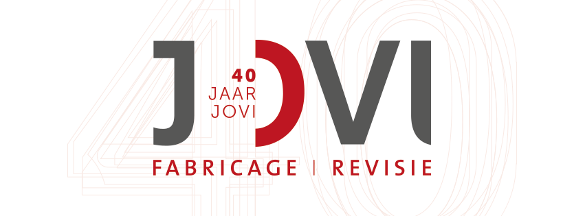

# Jovi inspectiesysteem

Gebasseerd op het Back-end framework Laravel en werkt met het admin panel Filament.

## Commands

### Eerste keer
- `docker run --rm --interactive --tty --volume $PWD:/app --user $(id -u):$(id -g) composer install` Alle composer packages installeren
- `npm install` Alle NPM packages installeren
- `php artisan migrate` Database installeren
- `php artisan migrate:fresh --seed` Alle migrations opnieuw runnen en database seeden
- `php artisan make:filament-user` Filament gebruiker aanmaken (email: admin@admin.com met wachtwoord: admin123 kan je ook gebruiken)
- `php artisan key:generate` App key genereren

### Elke keer bij opstarten
- `php artisan serve` Laravel start development server
- `npm run dev` Vite build assets

### Laravel models
- `php artisan make:model ModelNaam --migration` Eqoulent model maken met de migration
- `php artisan migrate` Migrations uitvoeren
- `php artisan make:migration model_naam` Lege migration aanmaken

### Filament admin panel
- `php artisan make:filament-resource ModelNaam --generate` Filament resouerce maken met alle tabel en form velden
- `php artisan make:filament-relation-manager ModelNaamResource tabel_waarop tekst_veld` Filament relatie maken van model met een tabel

### Factories en seeders
- `php artisan make:factory ModelNaamFactory` Factory aanmaken voor een model
- `php artisan make:seeder ModelNaamSeeder` Seeder aanmaken voor een model

Alle fake data sources zijn <a href="https://fakerphp.github.io/">hier</a> te vinden.

Alle icons die gebruikt worden zijn <a href="https://v1.heroicons.com/">hier</a> te vinden.
